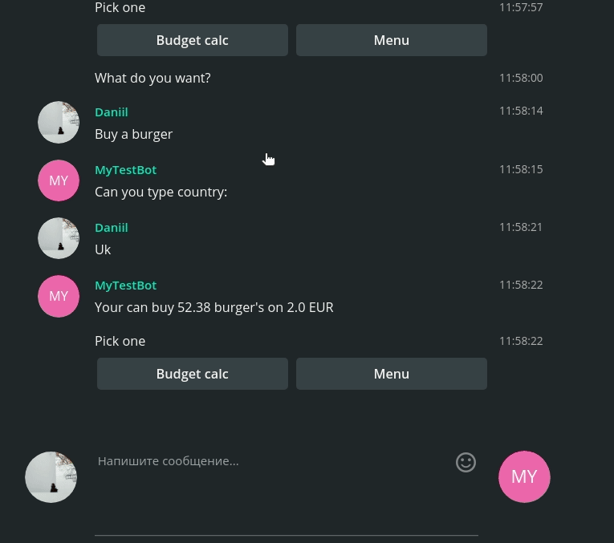

# JAICF Caila Simple Bot

Here is a ready to use [JAICF](https://github.com/just-ai/jaicf-kotlin) bot that can be ran locally or deployed to JAICP.

Bot demonstrates what you can buy in another countries. Budget counted in USD.

# How to use

Please refer to the detailed [Quick Start](https://github.com/just-ai/jaicf-kotlin/wiki/Quick-Start) that shows how to use this template with JAICP and CAILA NLU services.

#### You can import Caila entities and intents from JAICP interface 

# How it works

